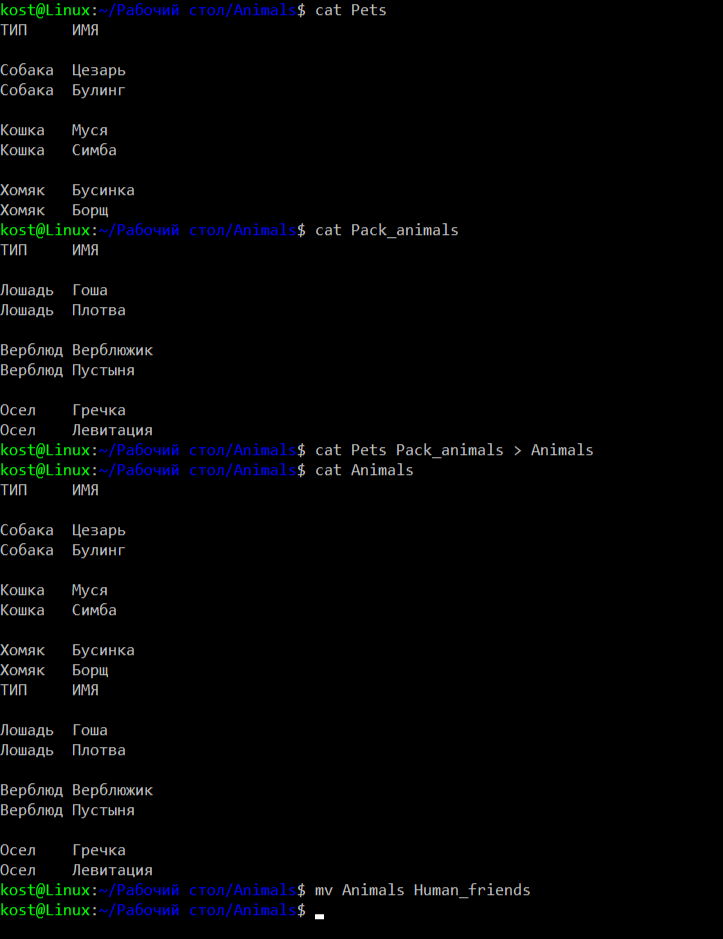
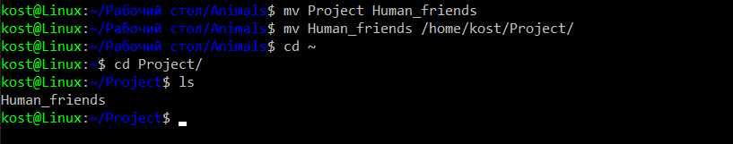
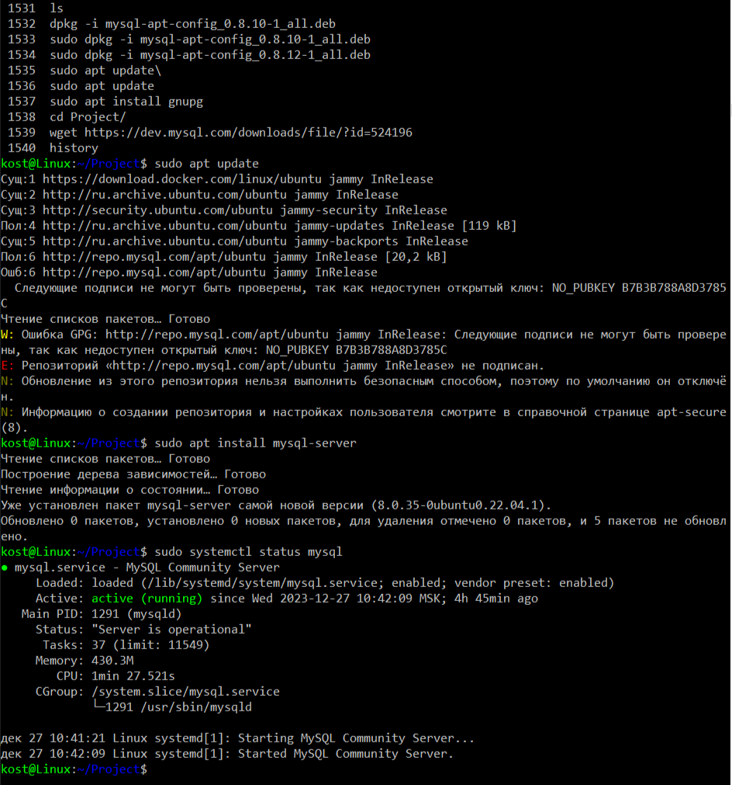
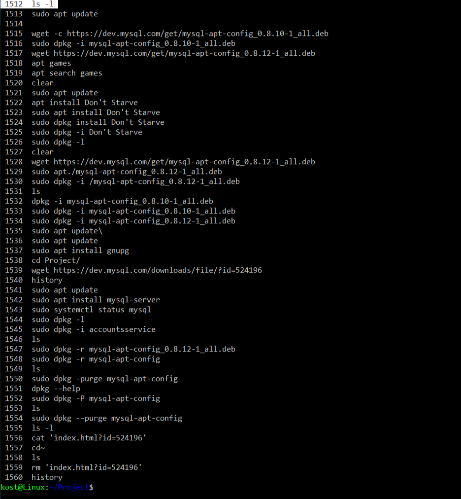
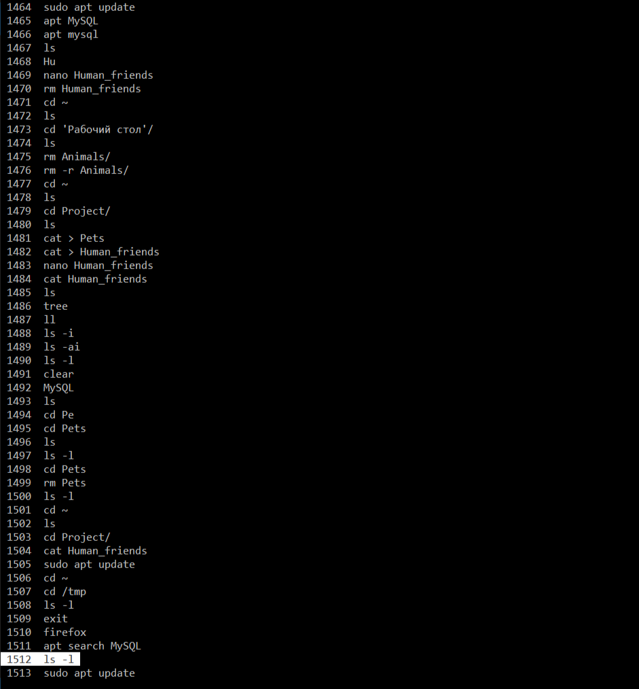
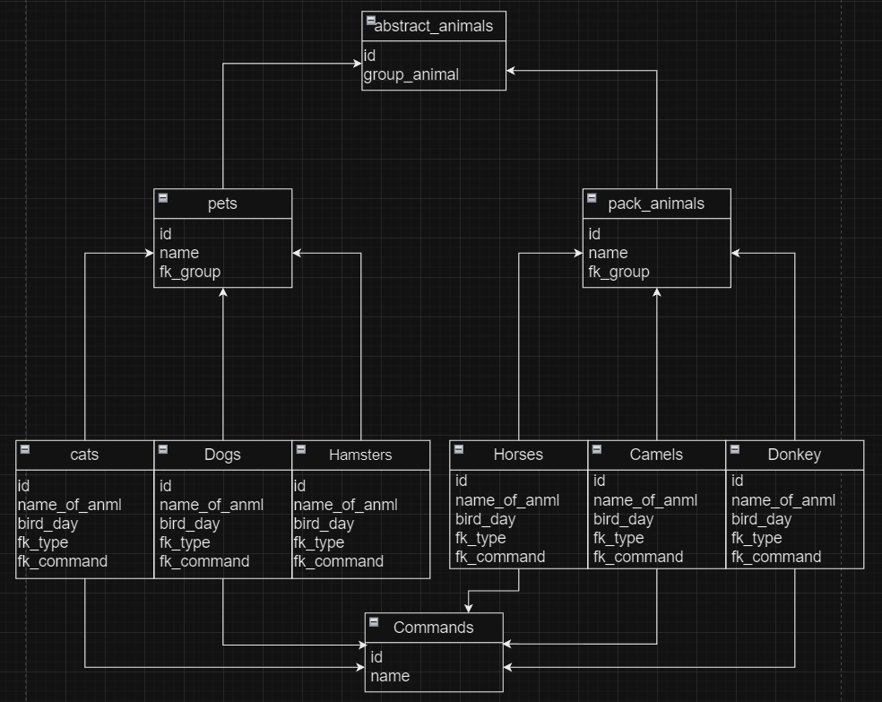

1. Используя команду cat в терминале операционной системы Linux, создать
два файла Домашние животные (заполнив файл собаками, кошками,
хомяками) и Вьючные животными заполнив файл Лошадьми, верблюдами и
ослы, а затем объединить их. Просмотреть содержимое созданного файла.
Переименовать файл, дав ему новое имя (Друзья человека).

    

2. Создать директорию, переместить файл туда

    

3. Подключить дополнительный репозиторий MySQL. Установить любой пакет
из этого репозитория.

    

4. Установить и удалить deb-пакет с помощью dpkg.

5. Выложить историю команд в терминале ubuntu

    
    

6. Нарисовать диаграмму, в которой есть класс родительский класс, домашние
животные и вьючные животные, в составы которых в случае домашних
животных войдут классы: собаки, кошки, хомяки, а в класс вьючные животные
войдут: Лошади, верблюды и ослы.

    

7. В подключенном MySQL репозитории создать базу данных “Друзья
человека”

    

8. Создать таблицы с иерархией из диаграммы в БД

###
    create table abstract_animal
    (
        id int primary key auto_increment not null,
        group_animal varchar(20)
    );

    create table type_animals
    (
        id int primary key auto_increment not null,
        name varchar(50),
        fk_group int references abstract_animal (id)
    );

    create table exist_animal
    (
        id int primary key auto_increment not null,
        name_of_anml varchar(50),
        bird_day date,
        fk_type int references type_animal (id),
        fk_command int references commands (id)
    );

    create table commands
    (
        id int primary key auto_increment,
        name varchar(100)
    );

9. Заполнить низкоуровневые таблицы именами(животных), командами
которые они выполняют и датами рождения

###
    insert into abstract_animal (group_animal) value ("домашний питомец");
    insert into abstract_animal (group_animal) value ("Вьючное животное");

    insert into type_animals (name, fk_group) value ("Собака", 1);
    insert into type_animals (name, fk_group) value ("Кошка", 1);
    insert into type_animals (name, fk_group) value ("Хомяк", 1);
    insert into type_animals (name, fk_group) value ("Лошадь", 2);
    insert into type_animals (name, fk_group) value ("Верблюд", 2);
    insert into type_animals (name, fk_group) value ("Осел", 2);

    insert into exist_animal (name_of_anml, bird_day, fk_type, fk_command) value("цезарь", '2020-02-22', 1, 1);
    insert into exist_animal (name_of_anml, bird_day, fk_type, fk_command) value("Булинг", '2019-12-09', 1, 2);
    insert into exist_animal (name_of_anml, bird_day, fk_type, fk_command) value("Муся", '2018-04-29', 2, 3);
    insert into exist_animal (name_of_anml, bird_day, fk_type, fk_command) value("Симба", '2021-06-03', 2, 12);
    insert into exist_animal (name_of_anml, bird_day, fk_type, fk_command) value("Бусинка", '2020-08-13', 3, 9);
    insert into exist_animal (name_of_anml, bird_day, fk_type, fk_command) value("Борщ", '2022-12-23', 3, 7);
    insert into exist_animal (name_of_anml, bird_day, fk_type, fk_command) value("Гоща", '2015-05-01', 4, 14);
    insert into exist_animal (name_of_anml, bird_day, fk_type, fk_command) value("Плотва", '2017-10-30', 4, 22);
    insert into exist_animal (name_of_anml, bird_day, fk_type, fk_command) value("Верблюжик", '2016-01-24', 5, 23);
    insert into exist_animal (name_of_anml, bird_day, fk_type, fk_command) value("Пустыня", '2013-07-02', 5, 16);
    insert into exist_animal (name_of_anml, bird_day, fk_type, fk_command) value("Гречка", '2015-05-04', 6, 5);
    insert into exist_animal (name_of_anml, bird_day, fk_type, fk_command) value("Левитация", '2015-02-03', 6, 20);

    insert into commands (name) value/*1*/("Сидеть");
    insert into commands (name) value/*2*/("Лежать");
    insert into commands (name) value/*3*/("Голос");
    insert into commands (name) value/*4*/("Гулять");
    insert into commands (name) value/*5*/("Пелвать");
    insert into commands (name) value/*6*/("Есть");
    insert into commands (name) value/*7*/("Спать");
    insert into commands (name) value/*8*/("Фу!");
    insert into commands (name) value/*9*/("Взять! (работает как 'АВАДАКЕДАВРА')");
    insert into commands (name) value/*10*/("Взять (работает как просто что-то взять в пасть)");
    insert into commands (name) value/*11*/("Брось");
    insert into commands (name) value/*12*/("Прыжок");
    insert into commands (name) value/*13*/("Кушать");
    insert into commands (name) value/*14*/("Кружить");
    insert into commands (name) value/*15*/("Бегать за хвостом");
    insert into commands (name) value/*16*/("Открыть дверь");
    insert into commands (name) value/*17*/("Рядом");
    insert into commands (name) value/*18*/("Играть");
    insert into commands (name) value/*20*/("Умри");
    insert into commands (name) value/*21*/("Рысью");
    insert into commands (name) value/*22*/("Галоп");
    insert into commands (name) value/*23*/("Марш");

    